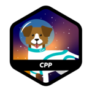

  

  

# Nathan Bardavid :wave:

Welcome to my GitHub! A 42 student deeply immersed in coding adventures and the art of tinkering on my PC. Here's a snapshot:

---

## 🖥️ About Me

- Started coding at 16, exploring the digital realm.
- Engaged in C and C++ projects, constantly curious.
- Loves to experiment and create with code.

## 🚀 Projects

- My portfolio showcases projects that span academic to personal, primarily in C and C++.

## 🛠 Skills

- **Languages:** `C`, `C++`, `Python`
- **Tools & Environments:** `Bash`, `Linux`, `Arch`, `NeoVim`
- For a detailed skills badge collection, check my repositories.

  

## ❤️  Hobbies

- Beyond coding, I'm all about pushing limits and exploring new tech frontiers.

## 42 profile

  

    
 <h3>Achievements : </h3> 

    <li> 1st Circle :
          
    <li>2nd Circle :   
    <li>3rd Circle : 
    <li>4rd Circle : 

<!--
**lourio0/lourio0** is a ✨ _special_ ✨ repository because its `README.md` (this file) appears on your GitHub profile.

Here are some ideas to get you started:

- 🔭 I’m currently working on ...
- 🌱 I’m currently learning ...
- 👯 I’m looking to collaborate on ...
- 🤔 I’m looking for help with ...
- 💬 Ask me about ...
- 📫 How to reach me: ...
- 😄 Pronouns: ...
- ⚡ Fun fact: ...
-->
